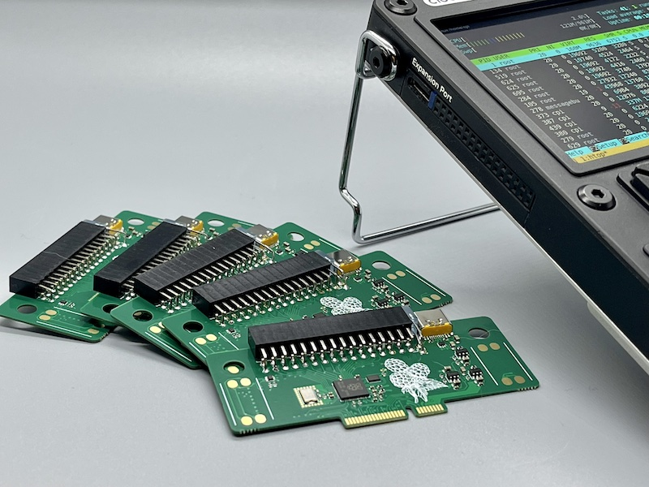

## μPico



### What is it?

uPico is a [RP2040](https://www.raspberrypi.com/products/rp2040/) powered expansion card designed to enhance the capabilities of [Clockwork's uConsole](https://www.clockworkpi.com/uconsole).

Second project name is `atto`, cause 10<sup>−6</sup> * 10<sup>-12</sup> = 10<sup>-18</sup> 🤓

### Features

* Internal Speakers Support
* Type-C (USB 2.0) port with programmable power switch and overcurrent protection
* 3.3V and 5V external power out with programmable switch and overcurrent protection
* RP2040 with extenal double-double PMOD compatible connector
* RP2040 controllable LED

## Resources

- [Schematics](docs/upico.pdf)
- [PCB Viewer](https://kicanvas.org/?github=https%3A%2F%2Fgithub.com%2Fdotcypress%2Fupico%2Fblob%2Fmain%2Fpcb%2Fupico.kicad_pcb)
- [Interactive BOM](https://htmlpreview.github.io/?https://github.com/dotcypress/upico/blob/main/docs/ibom.html)

<a href="https://www.tindie.com/stores/quadbit"></a>

### Control app installation

⚠️ Only R-01 core is supported for now.

1. Download latest build from [Releases page](https://github.com/dotcypress/upico/releases)
2. Extract installer: `mkdir dist && tar -xzf upico_%version%.%arch%.tar.gz -C dist`
3. Install: `cd dist && sudo ./install.sh`
4. Cleanup: `cd .. && rm -rf dist`
5. Print help: `upico help`

### Building control app from sources

1. Install rustup by following the instructions at https://rustup.rs
2. Clone this repo: `git clone git@github.com:dotcypress/upico.git && cd upico`
3. Build: `cargo build --release`
4. Install app: `sudo cp target/release/upico /usr/local/bin/`
5. Install service: `sudo cp upico.service /etc/systemd/system/`
6. Enable service: `sudo systemctl enable upico`
7. Start service: `sudo systemctl start upico`
8. Print help: `upico help`

### Flash firmware

1. `wget https://rptl.io/pico-blink`
2. `upico install pico-blink`

See other examples: https://github.com/raspberrypi/pico-examples

### High level design diagram


### RP4040 Pinout
```
╔══════╦══════╗
║ AUX  ║ AUX  ║
╠══════╬══════╣
║ VDD  ║ VDD  ║
║ GND  ║ GND  ║
║ IO3  ║ IO7  ║
║ IO2  ║ IO6  ║
║ IO1  ║ IO5  ║
║ IO0  ║ IO4  ║
╠══════╬══════╣
║ IO27 ║ IO29 ║
║ IO26 ║ IO28 ║
║ IO18 ║ IO19 ║
╠══════╬══════╣
║ VDD  ║ VDD  ║
║ GND  ║ GND  ║
║ IO11 ║ IO15 ║
║ IO10 ║ IO14 ║
║ IO9  ║ IO13 ║
║ IO8  ║ IO12 ║
╚══════╩══════╝
```

## License

Licensed under either of

- Apache License, Version 2.0 ([LICENSE-APACHE](LICENSE-APACHE) or
  http://www.apache.org/licenses/LICENSE-2.0)
- MIT license ([LICENSE-MIT](LICENSE-MIT) or http://opensource.org/licenses/MIT)

at your option.

### Contribution

Unless you explicitly state otherwise, any contribution intentionally submitted
for inclusion in the work by you, as defined in the Apache-2.0 license, shall be
dual licensed as above, without any additional terms or conditions.
