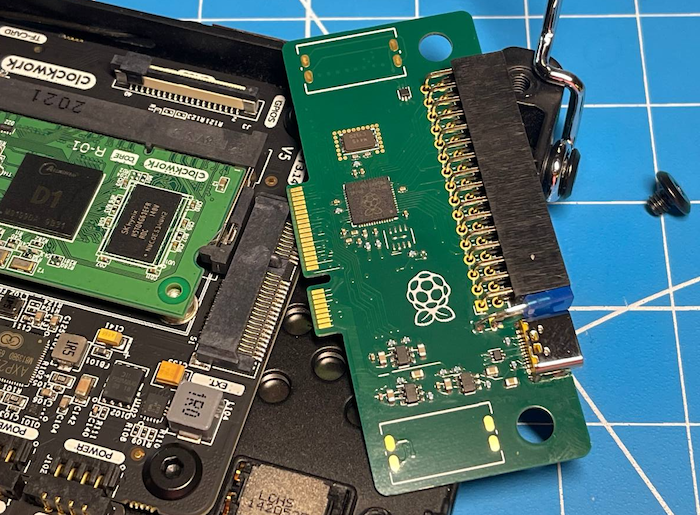

# uPico

[Clockwork uConsole](https://www.clockworkpi.com/uconsole) expansion card.

## Features

* uConsole speakers support
* Type-C Port (USB 2.0) with programmable power switch and overcurrent protection
* 3.3V and 5V extennal power with programmable switch and overcurrent protection
* Programmable RP2040 chip
* Double-Double PMOD compatible connector

## License

Licensed under either of

- Apache License, Version 2.0 ([LICENSE-APACHE](LICENSE-APACHE) or
  http://www.apache.org/licenses/LICENSE-2.0)
- MIT license ([LICENSE-MIT](LICENSE-MIT) or http://opensource.org/licenses/MIT)

at your option.

### Contribution

Unless you explicitly state otherwise, any contribution intentionally submitted
for inclusion in the work by you, as defined in the Apache-2.0 license, shall be
dual licensed as above, without any additional terms or conditions.
