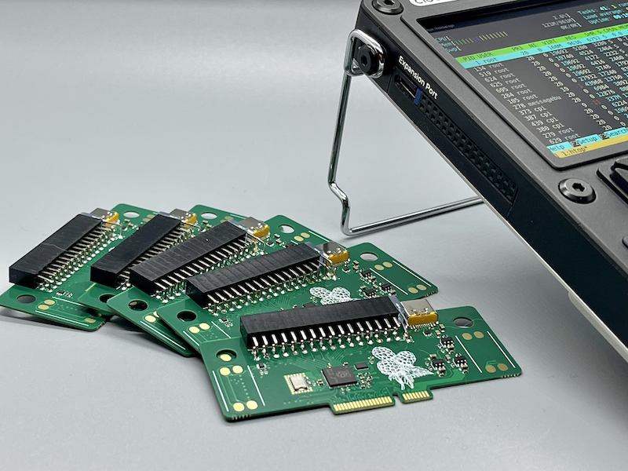

## μPico



### What is it?
uPico is a [RP2040](https://www.raspberrypi.com/products/rp2040/) powered expansion card designed to enhance the capabilities of [Clockwork's uConsole](https://www.clockworkpi.com/uconsole).

### Features

* Internal Speakers Support
* Type-C (USB 2.0) port with programmable power switch and overcurrent protection
* 3.3V and 5V external power out with programmable switch and overcurrent protection
* RP2040 with extenal double-double PMOD compatible connector
* RP2040 controllable LED

### Pinout
```
╔══════╦══════╗
║ AUX  ║ AUX  ║
╠══════╬══════╣
║ VDD  ║ VDD  ║
║ GND  ║ GND  ║
║ IO3  ║ IO7  ║
║ IO2  ║ IO6  ║
║ IO1  ║ IO5  ║
║ IO0  ║ IO4  ║
╠══════╬══════╣
║ IO27 ║ IO29 ║
║ IO26 ║ IO28 ║
║ SDA  ║ SCL  ║
╠══════╬══════╣
║ VDD  ║ VDD  ║
║ GND  ║ GND  ║
║ IO11 ║ IO15 ║
║ IO10 ║ IO14 ║
║ IO9  ║ IO13 ║
║ IO8  ║ IO12 ║
╚══════╩══════╝
```

## Resources

- [Schematics](fab/upico.pdf)
- [PCB Viewer](https://kicanvas.org/?github=https%3A%2F%2Fgithub.com%2Fdotcypress%2Fupico%2Fblob%2Fmain%2Fpcb%2Fupico.kicad_pcb)
- [Interactive BOM](https://htmlpreview.github.io/?https://github.com/dotcypress/upico/blob/main/fab/ibom.html)

## License

Licensed under either of

- Apache License, Version 2.0 ([LICENSE-APACHE](LICENSE-APACHE) or
  http://www.apache.org/licenses/LICENSE-2.0)
- MIT license ([LICENSE-MIT](LICENSE-MIT) or http://opensource.org/licenses/MIT)

at your option.

### Contribution

Unless you explicitly state otherwise, any contribution intentionally submitted
for inclusion in the work by you, as defined in the Apache-2.0 license, shall be
dual licensed as above, without any additional terms or conditions.
